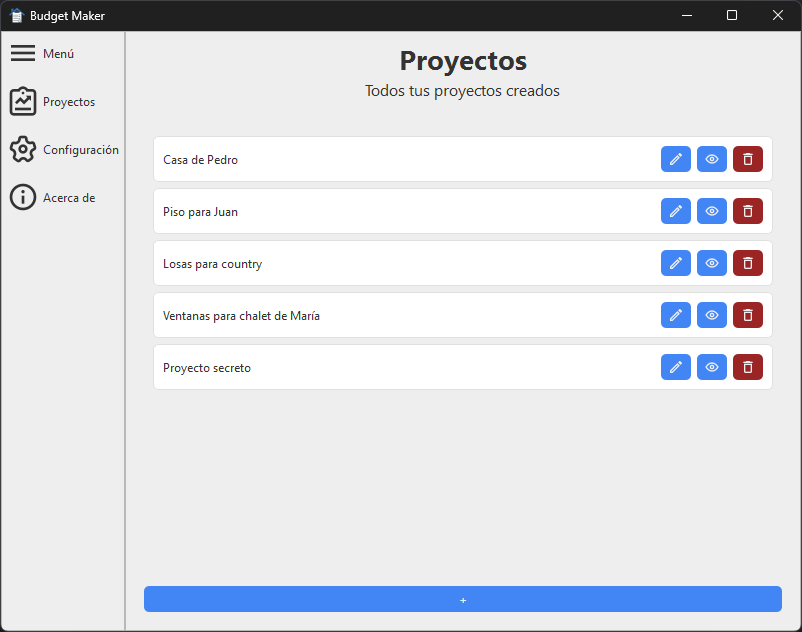
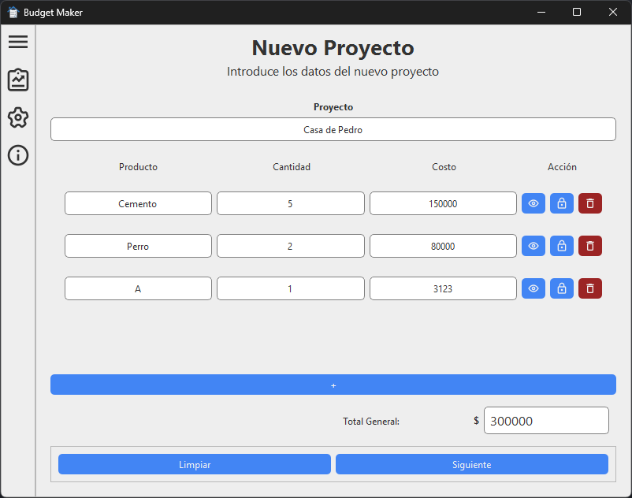
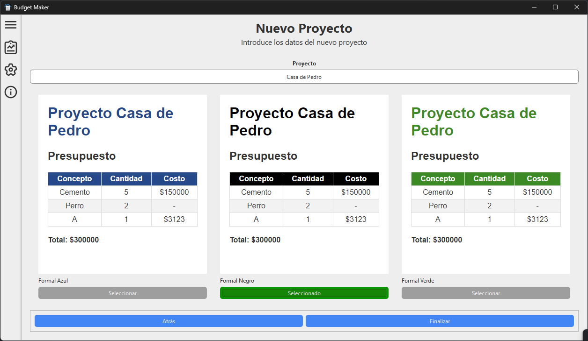
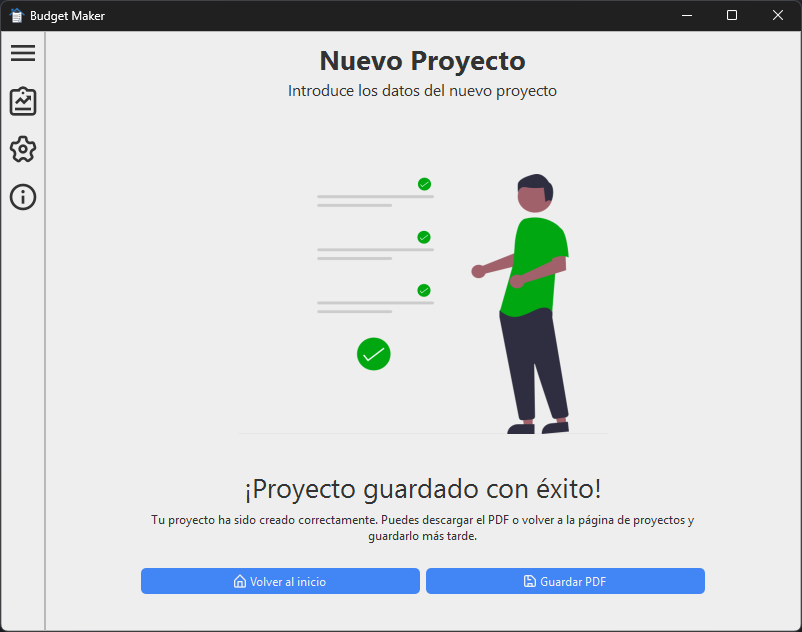
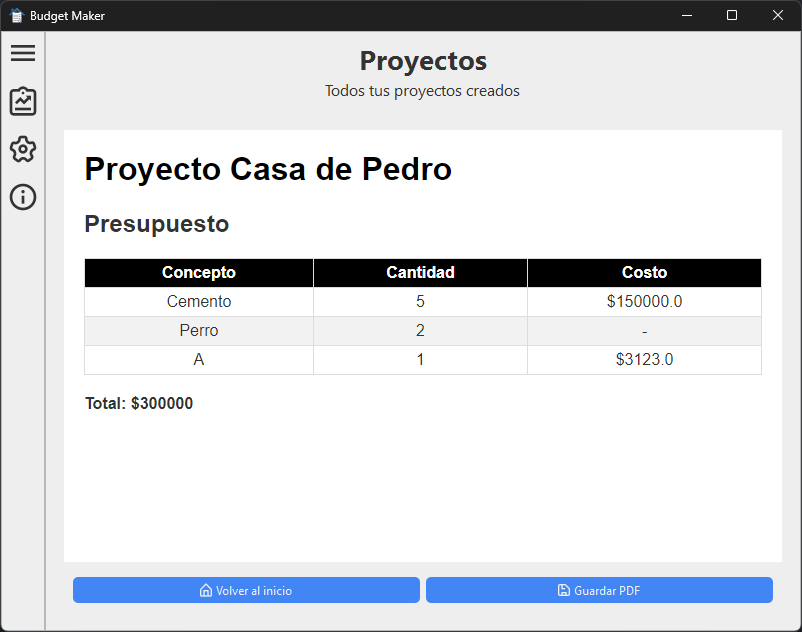
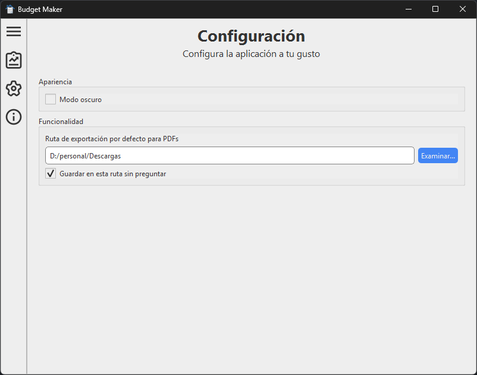
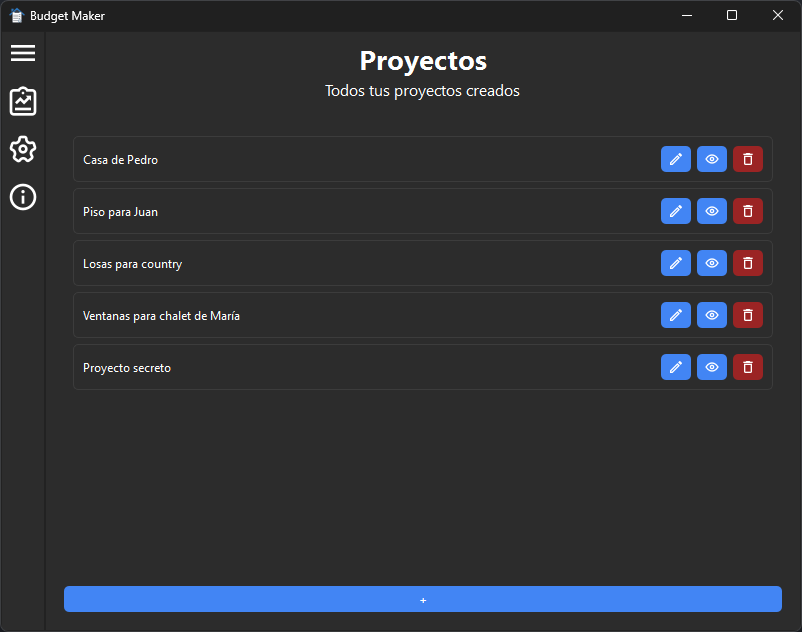

# Budget Maker Desktop

---

## 💡 Introducción

Budget Maker Desktop es una aplicación de escritorio que permite crear y gestionar presupuestos de manera sencilla y rápida.  
La aplicación está desarrollada en Python y utiliza la librería PySide6 para la interfaz gráfica.

## ✨ Características

- ✨ **Gestión de presupuestos**: Podrás crear, editar y eliminar tus presupuestos. Los mismos se guardarán en una base de datos local.

- ✨ **Gestión de productos**: Podrás agregar productos y/o servicios que brindes a tus presupuestos, con su respectivo precio y cantidad. Próximamente se añadirá la posibilidad de autocompletar productos.
- ✨ **Estilos de plantilla**: Podrás elegir entre distintos estilos de plantilla para exportar tus presupuestos, y próximamente podrás personalizarlos a tu gusto.
- ✨ **Exportar presupuestos**: Podrás exportar tus presupuestos a un archivo PDF para compartirlos con tus clientes, eligiendo entre distintos estilos de plantilla.
- ✨ **Configuración**: Están contempladas distintas configuraciones para personalizar la aplicación para que sea más cómoda para ti.

## 📖 Instalación

1. Descarga la última versión de la aplicación visitando la [sección de releases]([https://](https://github.com/4l3j0Ok/budget-maker-desktop/releases)) haciendo clic [aquí](https://github.com/4l3j0Ok/budget-maker-desktop/releases/latest/download/budget-maker-desktop.zip) para descargar la versión más reciente.
2. Descomprime el archivo descargado.
3. Ejecuta el archivo `budget-maker-desktop.exe` para iniciar la aplicación.
4. Crea un acceso directo a la aplicación en tu escritorio para acceder más fácilmente.
5. ¡Listo! Ya puedes comenzar a utilizar Budget Maker Desktop.

## 📷 Capturas de pantalla

> 
> Listado de proyectos.

> 
> Creación de un nuevo proyecto.

> 
> Selección de plantilla para exportar el proyecto.

>
> Finalización del proyecto.

> 
> Previsualización del proyecto.

> 
> Configuración de la aplicación.

> 
> Aplicación en modo oscuro.

## 🐛 Ayuda y soporte

Si notas algún error o tienes alguna sugerencia, no dudes en abrir un [issue](https://github.com/4l3j0Ok/budget-maker-desktop/issues) en el repositorio.

## 📝 Licencia

Este proyecto está bajo la licencia Prosperity Public License 3.0.0. Para más información, visita el archivo [LICENSE.md](./LICENSE.md).

## 🙏 Agradecimientos

Proyecto nacido de la necesidad de mi padre de crear presupuestos de manera rápida y sencilla para sus clientes. Para vos, papá ❤️.

---

Creado con cariño y café por [Alejoide](https://alejoide.com).
